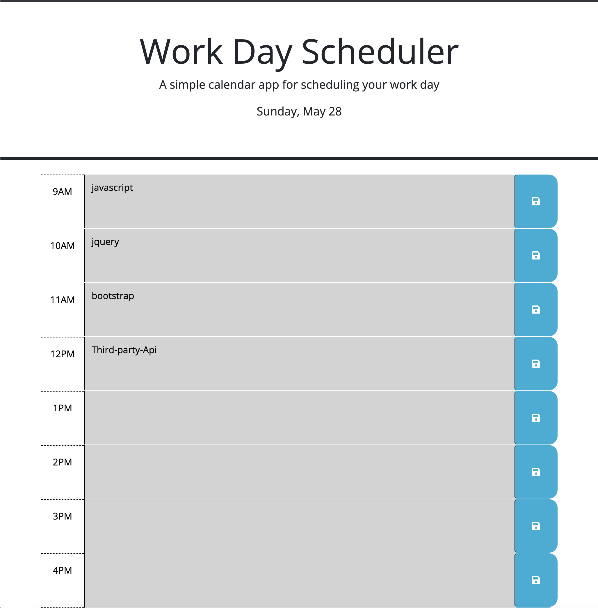

## Description

A simple calendar application that allows a user to save events for each hour of the day by.

## Installation

N/A

## App link

https://tegaomare.github.io/work-day-scheduler/

## Usage Instructions

AS AN employee with a busy schedule
you WANT to add important events to a daily planner
SO THAT you can manage your time effectively

### Specifications

This app will run in the browser and feature dynamically updated HTML and CSS powered by jQuery.

## Credits

https://api.jquery.com
www.w3schools.com

## License

MIT license
